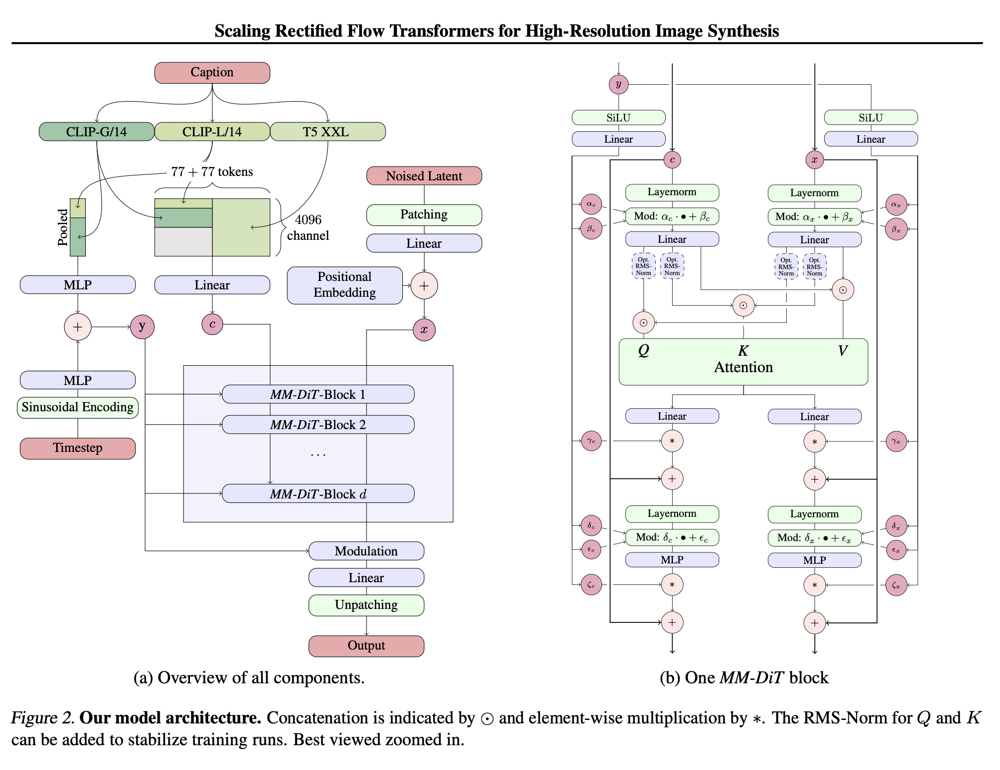

Flux is a generative diffusion model from Blackforest Labs. Diffusion is a process by which particles spread out from a high concentration to a low concentration. The model uses a series of transformations to generate images, starting from a simple noise vector and gradually generating an image over some number of steps.
Here is some output of the model:

[Diffusion-kit](https://github.com/argmaxinc/DiffusionKit/tree/main) provides a simple interface to run the model on a macbook,

```bash
diffusionkit-cli --prompt "prompt" \
--steps 3  --output-path "featured.png"
```

And in python:

```python
from diffusionkit.mlx import FluxPipeline
pipeline = FluxPipeline(
  shift=1.0,
  model_version="argmaxinc/mlx-FLUX.1-schnell",
  low_memory_mode=True,
  a16=True,
  w16=True,
)

HEIGHT = 512
WIDTH = 512
NUM_STEPS = 4  #  4 for FLUX.1-schnell, 50 for SD3
CFG_WEIGHT = 0. # for FLUX.1-schnell, 5. for SD3

image, _ = pipeline.generate_image(
  "a photo of a cat",
  cfg_weight=CFG_WEIGHT,
  num_steps=NUM_STEPS,
  latent_size=(HEIGHT // 8, WIDTH // 8),
)

image.save("image.png")
```


Quite impressive. I thought diffusion would require more steps.
In thermodynamics, diffusion is a slow process, the long-time limit of
how much a system can change.
Certainly, something exciting is going on under the hood.
The model is based on an architecture published on "Scaling Rectified Flow Transformers for High-Resolution Image Synthesis" by Stability AI ([paper](https://arxiv.org/pdf/2403.03206]).

# The architecture



Let's see the code:

```python
class MMDiT(nn.Module):
def __init__(self, config: MMDiTConfig):
        super().__init__()
        self.config = config

        # Input adapters and embeddings
        self.x_embedder = LatentImageAdapter(config)

        if config.pos_embed_type == PositionalEncoding.LearnedInputEmbedding:
            self.x_pos_embedder = LatentImagePositionalEmbedding(config)
            self.pre_sdpa_rope = nn.Identity()
        elif config.pos_embed_type == PositionalEncoding.PreSDPARope:
            self.pre_sdpa_rope = RoPE(
                theta=10000,
                axes_dim=config.rope_axes_dim,
            )
        else:
            raise ValueError(
                f"Unsupported positional encoding type: {config.pos_embed_type}"
            )

        self.y_embedder = PooledTextEmbeddingAdapter(config)
        self.t_embedder = TimestepAdapter(config)
        self.context_embedder = nn.Linear(
            config.token_level_text_embed_dim,
            config.hidden_size,
        )

        self.multimodal_transformer_blocks = [
            MultiModalTransformerBlock(
                config,
                skip_text_post_sdpa=(i == config.depth_multimodal - 1)
                and (config.depth_unified < 1),
            )
            for i in range(config.depth_multimodal)
        ]

        if config.depth_unified > 0:
            self.unified_transformer_blocks = [
                UnifiedTransformerBlock(config) for _ in range(config.depth_unified)
            ]

        self.final_layer = FinalLayer(config)
```

# The forward pass:

```python
    def __call__(
        self,
        latent_image_embeddings: mx.array,
        token_level_text_embeddings: mx.array,
        timestep: mx.array,
    ) -> mx.array:
        batch, latent_height, latent_width, _ = latent_image_embeddings.shape
        token_level_text_embeddings = self.context_embedder(token_level_text_embeddings)

        if hasattr(self, "x_pos_embedder"):
            latent_image_embeddings = self.x_embedder(
                latent_image_embeddings
            ) + self.x_pos_embedder(latent_image_embeddings)
        else:
            latent_image_embeddings = self.x_embedder(latent_image_embeddings)

        latent_image_embeddings = latent_image_embeddings.reshape(
            batch, -1, 1, self.config.hidden_size
        )

        if self.config.pos_embed_type == PositionalEncoding.PreSDPARope:
            positional_encodings = self.pre_sdpa_rope(
                text_sequence_length=token_level_text_embeddings.shape[1],
                latent_image_resolution=(
                    latent_height // self.config.patch_size,
                    latent_width // self.config.patch_size,
                ),
            )
        else:
            positional_encodings = None

        # MultiModalTransformer layers
        if self.config.depth_multimodal > 0:
            for bidx, block in enumerate(self.multimodal_transformer_blocks):
                latent_image_embeddings, token_level_text_embeddings = block(
                    latent_image_embeddings,
                    token_level_text_embeddings,
                    timestep,
                    positional_encodings=positional_encodings,
                )

        # UnifiedTransformerBlock layers
        if self.config.depth_unified > 0:
            latent_unified_embeddings = mx.concatenate(
                (token_level_text_embeddings, latent_image_embeddings), axis=1
            )

            for bidx, block in enumerate(self.unified_transformer_blocks):
                latent_unified_embeddings = block(
                    latent_unified_embeddings,
                    timestep,
                    positional_encodings=positional_encodings,
                )

            latent_image_embeddings = latent_unified_embeddings[
                :, token_level_text_embeddings.shape[1] :, ...
            ]

        # Final layer
        latent_image_embeddings = self.final_layer(
            latent_image_embeddings,
            timestep,
        )

        if self.config.patchify_via_reshape:
            latent_image_embeddings = self.x_embedder.unpack(
                latent_image_embeddings, (latent_height, latent_width)
            )
        else:
            latent_image_embeddings = unpatchify(
                latent_image_embeddings,
                patch_size=self.config.patch_size,
                target_height=latent_height,
                target_width=latent_width,
                vae_latent_dim=self.config.vae_latent_dim,
            )
        return latent_image_embeddings
```

# The multi-modal transformer block

```python
class MultiModalTransformerBlock(nn.Module):
    def __init__(self, config: MMDiTConfig, skip_text_post_sdpa: bool = False):
        super().__init__()
        self.image_transformer_block = TransformerBlock(config)
        self.text_transformer_block = TransformerBlock(
            config, skip_post_sdpa=skip_text_post_sdpa
        )

        sdpa_impl = mx.fast.scaled_dot_product_attention
        self.sdpa = partial(sdpa_impl)

        self.config = config
        self.per_head_dim = config.hidden_size // config.num_heads

    def __call__(
        self,
        latent_image_embeddings: mx.array,  # latent image embeddings
        token_level_text_embeddings: mx.array,  # token-level text embeddings
        timestep: mx.array,  # pooled text embeddings + timestep embeddings
        positional_encodings: mx.array = None,  # positional encodings for rope
    ):
        # Prepare multi-modal SDPA inputs
        image_intermediates = self.image_transformer_block.pre_sdpa(
            latent_image_embeddings,
            timestep=timestep,
        )

        text_intermediates = self.text_transformer_block.pre_sdpa(
            token_level_text_embeddings,
            timestep=timestep,
        )

        batch = latent_image_embeddings.shape[0]

        def rearrange_for_sdpa(t):
            # Target data layout: (batch, head, seq_len, channel)
            return t.reshape(
                batch, -1, self.config.num_heads, self.per_head_dim
            ).transpose(0, 2, 1, 3)

        if self.config.depth_unified > 0:
            multimodal_sdpa_inputs = {
                "q": mx.concatenate(
                    [text_intermediates["q"], image_intermediates["q"]], axis=2
                ),
                "k": mx.concatenate(
                    [text_intermediates["k"], image_intermediates["k"]], axis=2
                ),
                "v": mx.concatenate(
                    [text_intermediates["v"], image_intermediates["v"]], axis=2
                ),
                "scale": 1.0 / np.sqrt(self.per_head_dim),
            }
        else:
            multimodal_sdpa_inputs = {
                "q": rearrange_for_sdpa(
                    mx.concatenate(
                        [image_intermediates["q"], text_intermediates["q"]], axis=1
                    )
                ),
                "k": rearrange_for_sdpa(
                    mx.concatenate(
                        [image_intermediates["k"], text_intermediates["k"]], axis=1
                    )
                ),
                "v": rearrange_for_sdpa(
                    mx.concatenate(
                        [image_intermediates["v"], text_intermediates["v"]], axis=1
                    )
                ),
                "scale": 1.0 / np.sqrt(self.per_head_dim),
            }

        if self.config.pos_embed_type == PositionalEncoding.PreSDPARope:
            assert positional_encodings is not None
            multimodal_sdpa_inputs["q"] = RoPE.apply(
                multimodal_sdpa_inputs["q"], positional_encodings
            )
            multimodal_sdpa_inputs["k"] = RoPE.apply(
                multimodal_sdpa_inputs["k"], positional_encodings
            )

        if self.config.low_memory_mode:
            multimodal_sdpa_inputs[
                "memory_efficient_threshold"
            ] = SDPA_FLASH_ATTN_THRESHOLD

        # Compute multi-modal SDPA
        sdpa_outputs = (
            self.sdpa(**multimodal_sdpa_inputs)
            .transpose(0, 2, 1, 3)
            .reshape(batch, -1, 1, self.config.hidden_size)
        )

        # Split into image-text sequences for post-SDPA layers
        img_seq_len = latent_image_embeddings.shape[1]
        txt_seq_len = token_level_text_embeddings.shape[1]

        if self.config.depth_unified > 0:
            text_sdpa_output = sdpa_outputs[:, :txt_seq_len, :, :]
            image_sdpa_output = sdpa_outputs[:, txt_seq_len:, :, :]
        else:
            image_sdpa_output = sdpa_outputs[:, :img_seq_len, :, :]
            text_sdpa_output = sdpa_outputs[:, -txt_seq_len:, :, :]

        # Post-SDPA layers
        latent_image_embeddings = self.image_transformer_block.post_sdpa(
            residual=latent_image_embeddings,
            sdpa_output=image_sdpa_output,
            **image_intermediates,
        )
        if self.text_transformer_block.skip_post_sdpa:
            # Text token related outputs from the final layer do not impact the model output
            token_level_text_embeddings = None
        else:
            token_level_text_embeddings = self.text_transformer_block.post_sdpa(
                residual=token_level_text_embeddings,
                sdpa_output=text_sdpa_output,
                **text_intermediates,
            )

        return latent_image_embeddings, token_level_text_embeddings
```
